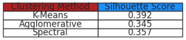

# Machine Learning Clustering System

- **Business Intelligence, Customer Segmentation, Unsupervised Learning of Machine Learning Models**

During my exchange semester in Italy, I attended this course from October 2024 to January 2025. Aspects such as data visualization, big data, supervised learning, unsupervised learning and data preparation were covered in the lectures. At the end of the course, I did a project on my own using clustering methods along with dimensionality reduction and a method for evaluating the quality of the formed clusters. More specifically, the following techniques were implemented:

- **Dimensionality Reduction:** Principal Component Analysis (PCA)

- **Optimization Methods** Elbow Method

- **Clustering Methods:** K-Means, Spectral Clustering & Agglomerative Clustering

- **Clustering Evaluation:** Silhouette Score

With the techniques listed above and a dataset of 2240 rows and 29 columns, I familiarized myself with concepts such as *Feauture Engineering*, *Data Cleaning* and *Exploratory Data Analysis*. I started with visualizing general distributions of the data, as a way of exploring and leaning about the structure of the dataset from a brief surface level. Then, I proceeded with preprocessing the data and applying PCA, as well as the Elbow Method to identify the optimal number of clusters. Furthermore, the three clustering methods were applied with *K* clusters to partition, and lastly the Silhouette Scores for of the three methods showcased their differences in performances. To allow for a more in-depth analysis I denoted one of the clustering methods as the *Baseline Method*, which is the configured or selected clustering method used for further visualizations. By default, in the submitted python notebook, I set it to *K-Means*, but the developer can easily alternate between *Spectral* and *Agglomerative* as well. One additional feature I implemented was the choice of clusters *K*. The developer can change it between 2-10, each one being their own unique color and visualized for all charts.

- For more information about my **code**, navigate to `/project/code.ipynb`

- For more information about my approach and the **actionable conclusions** derived from the visualizations, navigate to `project/docs/report.pdf`

## System

### Architecture

### Exploratory Data Analysis

Text

### Dimensionality Reduction

### Cluster Evaluation

### Further Cluster Analysis of Configured Method

### Conclusions

## My Related Experiences

- [Relational Analysis And Visualization](https://github.com/mrjex/Relational-Analysis-and-Visualization): *Machine Learning Prediciton Model with linear Regression*

- [Realtime Change Data Capture Streaming](https://github.com/mrjex/Realtime-Data-Capture-Streaming): *Manage real-time data in streaming pipeline and visualize in localhost*

- [Global City Streaming](https://github.com/mrjex/Global-City-Streaming): *Manage pipeline data and visualize in a vast multitude of distinct plots*

- [Tableau Visualization](https://github.com/mrjex/Tableau-Visualization): *Transform SQL data-models and visualize categorized data*

- [Artificial Intelligence Clusters](https://github.com/mrjex/Artificial-Intelligence-Clusters): *Machine Learning models using unsupervised learning to partition data into segments*

- [Neural Network Image Classification](https://github.com/mrjex/Neural-Network-Image-Classification): *A deep neural network fine-tuned by supervised learning for image classification*

- [US Political & Societal Data Visualization](https://github.com/mrjex/US-Political-and-Societal-Data-Visualization): *Data visualization using Python*

- [Artificial Intelligence Classifiers](https://github.com/mrjex/Artificial-Intelligence-Classifiers): *Machine Learning models using supervised learning*